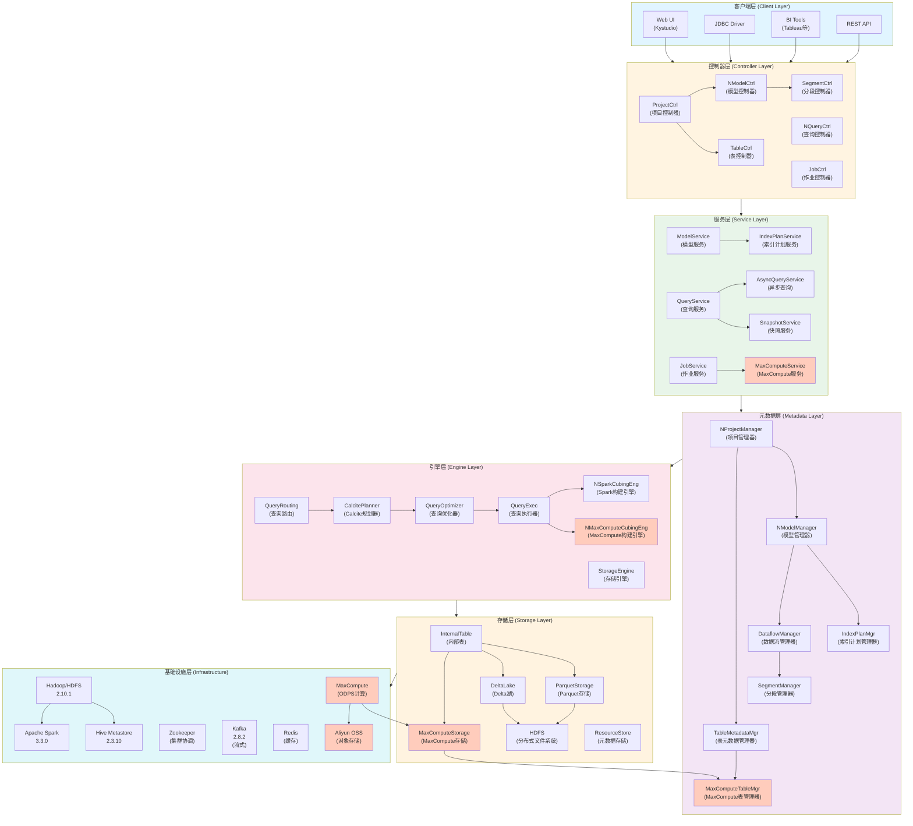
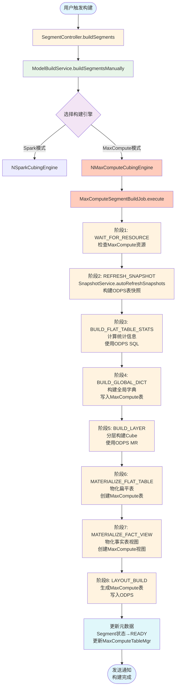
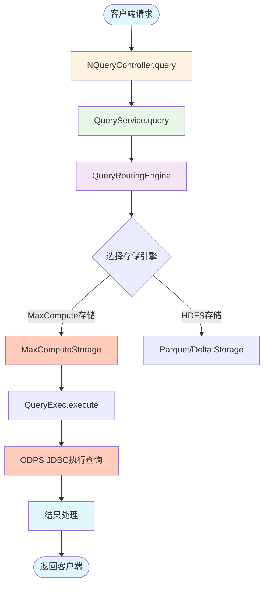
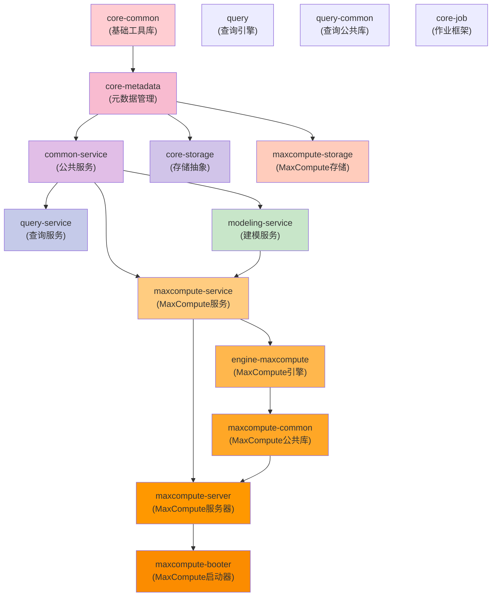
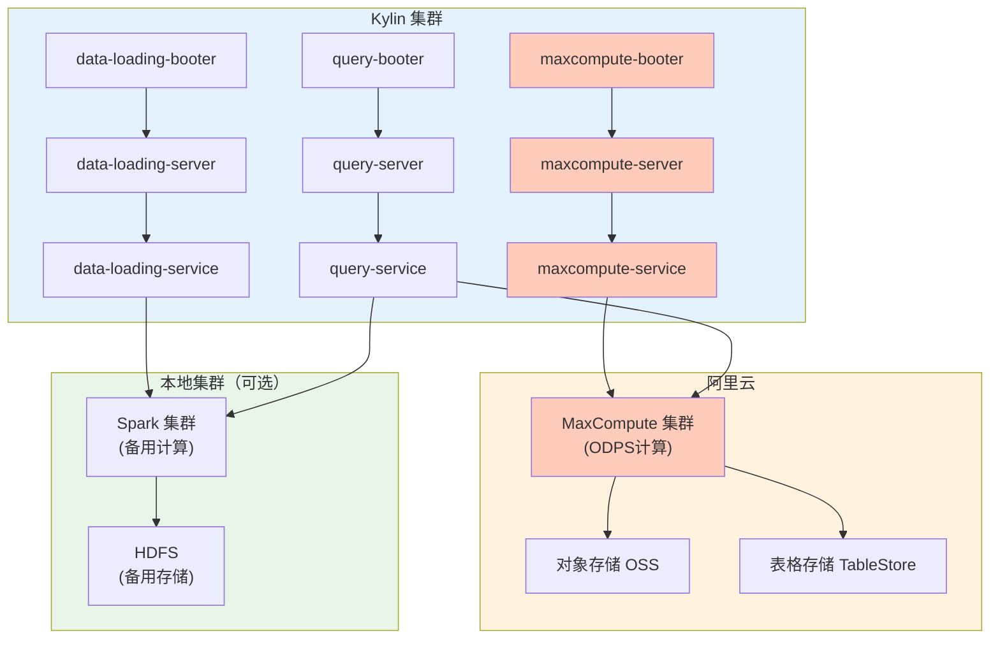
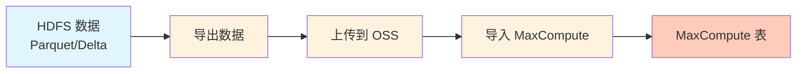

# Apache Kylin 5.0.4 MaxCompute 扩展架构文档

## 1. 扩展架构总览

本文档描述 Apache Kylin 如何扩展以支持 Aliyun MaxCompute 作为计算和存储引擎。

### 1.1 架构对比

| 层级 | 原架构 | MaxCompute 扩展架构 |
|------|--------|---------------------|
| 基础设施层 | Hadoop/HDFS + Apache Spark | Hadoop/HDFS + Apache Spark + **MaxCompute** |
| 存储层 | Parquet + Delta Lake + HDFS | Parquet + Delta Lake + HDFS + **MaxCompute Table** |
| 计算引擎 | Spark (NSparkCubingEngine) | Spark (NSparkCubingEngine) + **MaxCompute (NMaxComputeCubingEngine)** |
| 数据源 | Hive, JDBC, Kafka | Hive, JDBC, Kafka + **MaxCompute ODPS** |

### 1.2 设计原则

1. **兼容性**: 保持与现有 Hadoop/Spark 生态的完全兼容
2. **可插拔性**: 通过配置选择使用 Spark 或 MaxCompute 引擎
3. **统一接口**: 存储层提供统一抽象，底层可切换不同存储后端
4. **元数据统一**: 元数据管理器支持多种数据源和存储类型

## 2. 总体架构图



## 3. 新增模块说明

### 3.1 MaxCompute 服务模块

| 模块 | 路径 | 功能说明 |
|------|------|----------|
| **maxcompute-service** | `src/maxcompute-service` | MaxCompute 服务层，处理 MaxCompute 相关的业务逻辑 |
| **MaxComputeService** | `src/maxcompute-service/src/main/java/org/apache/kylin/rest/service/MaxComputeService.java` | MaxCompute 服务主类，提供 ODPS 表管理、作业提交、数据同步等功能 |
| **MaxComputeController** | `src/maxcompute-server/src/main/java/org/apache/kylin/rest/controller/MaxComputeController.java` | MaxCompute REST API 控制器 |

### 3.2 MaxCompute 引擎模块

| 模块 | 路径 | 功能说明 |
|------|------|----------|
| **engine-maxcompute** | `src/maxcompute-project/engine-maxcompute` | MaxCompute 构建引擎，负责在 MaxCompute 上执行 Segment 构建 |
| **NMaxComputeCubingEngine** | `src/maxcompute-project/engine-maxcompute/src/main/java/org/apache/kylin/engine/maxcompute/NMaxComputeCubingEngine.java` | MaxCompute 构建引擎主类，实现 CubingEngine 接口 |
| **MaxComputeSegmentBuildJob** | `src/maxcompute-project/engine-maxcompute/src/main/java/org/apache/kylin/engine/maxcompute/job/MaxComputeSegmentBuildJob.java` | MaxCompute Segment 构建作业 |

### 3.3 MaxCompute 存储模块

| 模块 | 路径 | 功能说明 |
|------|------|----------|
| **maxcompute-storage** | `src/maxcompute-storage` | MaxCompute 存储抽象层，提供与 HDFS 兼容的存储接口 |
| **MaxComputeStorage** | `src/maxcompute-storage/src/main/java/org/apache/kylin/storage/maxcompute/MaxComputeStorage.java` | MaxCompute 存储实现类 |
| **MaxComputeTableMgr** | `src/core-metadata/src/main/java/org/apache/kylin/metadata/maxcompute/MaxComputeTableMgr.java` | MaxCompute 表元数据管理器 |

### 3.4 MaxCompute 服务器模块

| 模块 | 路径 | 功能说明 |
|------|------|----------|
| **maxcompute-server** | `src/maxcompute-server` | MaxCompute 专用服务器，包含 MaxCompute 相关的控制器和服务 |

### 3.5 MaxCompute 启动器模块

| 模块 | 路径 | 功能说明 |
|------|------|----------|
| **maxcompute-booter** | `src/maxcompute-booter` | MaxCompute 服务启动器 |

## 4. 核心技术栈扩展

### 4.1 新增依赖

| 技术 | 版本 | 用途 |
|------|------|------|
| **MaxCompute SDK** | 0.44.x | MaxCompute Java SDK，用于连接和操作 ODPS |
| **Aliyun OSS SDK** | 3.17.x | 阿里云对象存储 SDK，用于数据存储 |
| **TableStore SDK** | 5.13.x | TableStore SDK（可选，用于索引存储） |
| **Odps-jdbc** | 3.5.x | MaxCompute JDBC 驱动，用于查询执行 |

### 4.2 Maven 依赖配置

```xml
<!-- MaxCompute SDK -->
<dependency>
    <groupId>com.aliyun.odps</groupId>
    <artifactId>odps-sdk-core</artifactId>
    <version>0.44.3-public</version>
</dependency>

<!-- Aliyun OSS SDK -->
<dependency>
    <groupId>com.aliyun.oss</groupId>
    <artifactId>aliyun-sdk-oss</artifactId>
    <version>3.17.4</version>
</dependency>

<!-- MaxCompute JDBC Driver -->
<dependency>
    <groupId>com.aliyun.odps</groupId>
    <artifactId>odps-jdbc</artifactId>
    <version>3.5.4</version>
</dependency>
```

## 5. 配置文件扩展

### 5.1 kylin.properties 新增配置项

```properties
# MaxCompute 引擎配置
kylin.engine.provider=maxcompute
kylin.engine.maxcompute.enabled=true

# MaxCompute 连接配置
kylin.maxcompute.project.name=your_project_name
kylin.maxcompute.access.id=your_access_id
kylin.maxcompute.access.key=your_access_key
kylin.maxcompute.end.point=http://service.odps.aliyun.com/api
kylin.maxcompute.tunnel.end.point=http://dt.odps.aliyun.com

# MaxCompute 存储配置
kylin.storage.maxcompute.enabled=true
kylin.storage.maxcompute.table.prefix=kylin_
kylin.storage.maxcompute.partition.enabled=true

# MaxCompute 计算配置
kylin.engine.maxcompute.job.queue=default
kylin.engine.maxcompute.job.priority=9
kylin.engine.maxcompute.job.memory.mb=4096
kylin.engine.maxcompute.job.cores=2

# OSS 存储配置（可选，用于数据备份）
kylin.storage.oss.enabled=false
kylin.storage.oss.endpoint=oss-cn-hangzhou.aliyuncs.com
kylin.storage.oss.bucket.name=your_bucket_name
kylin.storage.oss.access.id=your_oss_access_id
kylin.storage.oss.access.key=your_oss_access_key
```

### 5.2 存储引擎选择策略

```properties
# 存储引擎优先级配置
kylin.storage.engine.priority=maxcompute,deltalake,parquet

# 根据模型选择存储引擎
kylin.storage.engine.model.default=maxcompute
kylin.storage.engine.model.streaming=deltalake
kylin.storage.engine.model.historical=parquet
```

## 6. 数据构建流程（MaxCompute）

### 6.1 MaxCompute 构建流程图



### 6.2 MaxCompute 查询流程



## 7. 关键接口和类

### 7.1 CubingEngine 接口扩展

```java
public interface CubingEngine {
    /**
     * 提交构建作业
     */
    void submitBuildJob(CubingJob cubingJob) throws EngineException;

    /**
     * 获取作业状态
     */
    JobStatus getJobStatus(String jobId) throws EngineException;

    /**
     * 取消作业
     */
    void cancelJob(String jobId) throws EngineException;

    /**
     * 获取引擎类型
     */
    EngineType getEngineType();
}

public enum EngineType {
    SPARK,
    MAXCOMPUTE,
    HYBRID
}
```

### 7.2 Storage 接口扩展

```java
public interface IStorage {
    /**
     * 写入数据
     */
    void writeData(DataWriteRequest request) throws StorageException;

    /**
     * 读取数据
     */
    DataSet readData(DataReadRequest request) throws StorageException;

    /**
     * 删除数据
     */
    void deleteData(DataDeleteRequest request) throws StorageException;

    /**
     * 获取存储类型
     */
    StorageType getStorageType();
}

public enum StorageType {
    PARQUET,
    DELTA_LAKE,
    MAXCOMPUTE_TABLE,
    ALIYUN_OSS
}
```

## 8. 模块依赖关系图



## 9. 部署架构（混合模式）



## 10. API 端点扩展

### 10.1 MaxCompute 相关 API

| 方法 | 端点 | 说明 |
|------|------|------|
| POST | /api/maxcompute/tables | 创建 MaxCompute 表 |
| GET | /api/maxcompute/tables/{table} | 获取 MaxCompute 表信息 |
| DELETE | /api/maxcompute/tables/{table} | 删除 MaxCompute 表 |
| POST | /api/maxcompute/jobs | 提交 MaxCompute 作业 |
| GET | /api/maxcompute/jobs/{job_id} | 获取作业状态 |
| PUT | /api/maxcompute/config | 配置 MaxCompute 连接 |
| GET | /api/maxcompute/partitions/{table} | 获取分区信息 |

### 10.2 引擎切换 API

| 方法 | 端点 | 说明 |
|------|------|------|
| PUT | /api/models/{model}/engine | 切换模型构建引擎 |
| GET | /api/models/{model}/engine | 获取模型当前引擎 |

## 11. 数据迁移

### 11.1 从 HDFS 迁移到 MaxCompute



### 11.2 迁移工具

提供命令行工具和 REST API 用于数据迁移：

```bash
# 命令行工具
./kylin.sh migrate-to-maxcompute \
  --project my_project \
  --model my_model \
  --source-engine spark \
  --target-engine maxcompute \
  --parallel 4
```

## 12. 监控和运维

### 12.1 MaxCompute 作业监控

| 指标 | 说明 | 监控方式 |
|------|------|----------|
| 作业提交数 | 提交到 MaxCompute 的作业数量 | MaxComputeService.countSubmittedJobs() |
| 作业成功率 | MaxCompute 作业成功比例 | MaxComputeService.calculateSuccessRate() |
| 作业耗时 | MaxCompute 作业平均耗时 | MaxComputeService.getAverageDuration() |
| 存储使用量 | MaxCompute 表存储大小 | MaxComputeStorage.getStorageUsage() |
| 配额使用率 | MaxCompute 配额使用情况 | MaxComputeService.getQuotaUsage() |

### 12.2 告警规则

- 作业失败率超过 10%
- 作业平均耗时超过阈值（如 30 分钟）
- 存储使用量超过配额的 80%
- MaxCompute 连接失败

## 13. 性能优化

### 13.1 MaxCompute 优化策略

1. **分区优化**: 使用分区表加速查询
2. **列式存储**: 使用 MaxCompute 列式存储格式
3. **索引优化**: 利用 MaxCompute 的聚簇索引
4. **并行度**: 根据数据量调整并行度
5. **资源调优**: 根据作业类型调整内存和 CPU

### 13.2 缓存策略

```properties
# MaxCompute 查询结果缓存
kylin.query.cache.maxcompute.enabled=true
kylin.query.cache.maxcompute.ttl=3600
kylin.query.cache.maxcompute.max.size=1000
```

## 14. 成本管理

### 14.1 成本优化建议

1. **按需计算**: 仅在需要时使用 MaxCompute，日常使用 Spark
2. **数据分层**: 热数据用 MaxCompute，冷数据用 OSS
3. **作业合并**: 合并小作业减少次数
4. **配额管理**: 合理配置配额避免超限

### 14.2 成本监控

- 每日成本报表
- 成本趋势分析
- 异常成本告警
- 成本优化建议

## 15. 安全性

### 15.1 访问控制

- 使用 RAM 进行权限管理
- 支持 Access Key 和 STS Token
- 支持 VPN 和专线连接

### 15.2 数据加密

- 传输加密：HTTPS
- 存储加密：MaxCompute 数据盘加密
- 密钥管理：使用 KMS 管理密钥

## 16. 故障处理

### 16.1 常见问题

| 问题 | 原因 | 解决方案 |
|------|------|----------|
| 作业提交失败 | 配额不足 | 增加配额或排队等待 |
| 连接超时 | 网络问题 | 检查网络连接，使用专线 |
| 查询慢 | 数据倾斜 | 优化表结构，添加分区 |
| 元数据不一致 | 操作失败 | 执行修复工具 |

### 16.2 故障转移

- MaxCompute 不可用时自动切换到 Spark
- 数据双写：同时写入 HDFS 和 MaxCompute
- 定期校验数据一致性

## 17. 版本兼容性

| Kylin 版本 | MaxCompute SDK 版本 | 兼容性 |
|------------|---------------------|--------|
| 5.0.4 | 0.44.x | 完全兼容 |
| 5.0.x | 0.43.x | 需要测试 |
| 4.x | 0.40.x | 部分兼容 |

## 18. 参考资料

- [MaxCompute 官方文档](https://help.aliyun.com/product/27797.html)
- [MaxCompute Java SDK](https://help.aliyun.com/document_detail/27866.html)
- [MaxCompute JDBC](https://help.aliyun.com/document_detail/34245.html)
- [Aliyun OSS SDK](https://help.aliyun.com/document_detail/32068.html)