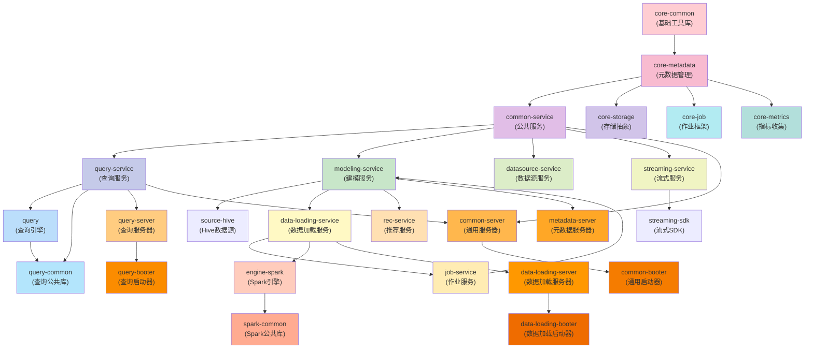
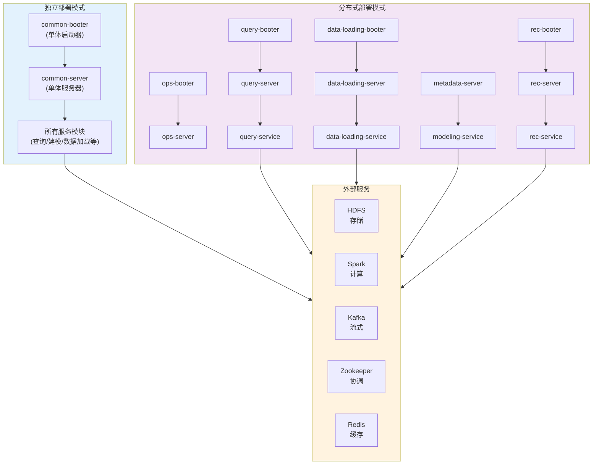

# Apache Kylin 5.0.4 架构文档

## 1. 总体架构图

```mermaid
graph TB
    subgraph Client["客户端层 (Client Layer)"]
        WebUI["Web UI<br/>(Kystudio)"]
        JDBC["JDBC Driver"]
        BITools["BI Tools<br/>(Tableau等)"]
        RESTAPI["REST API"]
    end

    subgraph Controller["控制器层 (Controller Layer)"]
        NQueryCtrl["NQueryCtrl<br/>(查询控制器)"]
        JobCtrl["JobCtrl<br/>(作业控制器)"]
        NModelCtrl["NModelCtrl<br/>(模型控制器)"]
        SegmentCtrl["SegmentCtrl<br/>(分段控制器)"]
        ProjectCtrl["ProjectCtrl<br/>(项目控制器)"]
        TableCtrl["TableCtrl<br/>(表控制器)"]
    end

    subgraph Service["服务层 (Service Layer)"]
        QueryService["QueryService<br/>(查询服务)"]
        JobService["JobService<br/>(作业服务)"]
        ModelService["ModelService<br/>(模型服务)"]
        AsyncQueryService["AsyncQueryService<br/>(异步查询)"]
        SnapshotService["SnapshotService<br/>(快照服务)"]
        IndexPlanService["IndexPlanService<br/>(索引计划服务)"]
    end

    subgraph Metadata["元数据层 (Metadata Layer)"]
        NProjectManager["NProjectManager<br/>(项目管理器)"]
        NModelManager["NModelManager<br/>(模型管理器)"]
        IndexPlanMgr["IndexPlanMgr<br/>(索引计划管理器)"]
        DataflowManager["DataflowManager<br/>(数据流管理器)"]
        SegmentManager["SegmentManager<br/>(分段管理器)"]
        TableMetadataMgr["TableMetadataMgr<br/>(表元数据管理器)"]
    end

    subgraph Engine["引擎层 (Engine Layer)"]
        QueryRouting["QueryRouting<br/>(查询路由)"]
        QueryExec["QueryExec<br/>(查询执行器)"]
        CalcitePlanner["CalcitePlanner<br/>(Calcite规划器)"]
        QueryOptimizer["QueryOptimizer<br/>(查询优化器)"]
        NSparkCubingEng["NSparkCubingEng<br/>(Spark构建引擎)"]
        StorageEngine["StorageEngine<br/>(存储引擎)"]
    end

    subgraph Storage["存储层 (Storage Layer)"]
        ParquetStorage["ParquetStorage<br/>(Parquet存储)"]
        DeltaLake["DeltaLake<br/>(Delta湖)"]
        InternalTable["InternalTable<br/>(内部表)"]
        HDFS["HDFS<br/>(分布式文件系统)"]
        ResourceStore["ResourceStore<br/>(元数据存储)"]
    end

    subgraph Infrastructure["基础设施层 (Infrastructure)"]
        ApacheSpark["Apache Spark<br/>3.3.0"]
        Hadoop["Hadoop/HDFS<br/>2.10.1"]
        Zookeeper["Zookeeper<br/>(集群协调)"]
        Kafka["Kafka<br/>2.8.2<br/>(流式)"]
        HiveMetastore["Hive Metastore<br/>2.3.10"]
        Redis["Redis<br/>(缓存)"]
    end

    WebUI --> Controller
    JDBC --> Controller
    BITools --> Controller
    RESTAPI --> Controller

    Controller --> Service
    Service --> Metadata
    Metadata --> Engine
    Engine --> Storage
    Storage --> Infrastructure

    style Client fill:#e1f5ff
    style Controller fill:#fff4e1
    style Service fill:#e8f5e9
    style Metadata fill:#f3e5f5
    style Engine fill:#fce4ec
    style Storage fill:#fff3e0
    style Infrastructure fill:#e0f7fa
```

## 2. 模块依赖关系图

## 3. 核心模块说明

### 3.1 基础模块 (Foundation Modules)

| 模块 | 路径 | 功能说明 |
|------|------|----------|
| **core-common** | `src/core-common` | 基础工具库，包含配置管理、加密工具、日志基础设施等 |
| **core-metadata** | `src/core-metadata` | 元数据管理层，负责项目、模型、索引、分段等元数据的持久化管理 |
| **core-storage** | `src/core-storage` | 存储抽象层，定义存储接口，支持Parquet、Delta Lake等多种存储格式 |
| **core-job** | `src/core-job` | 作业执行框架，提供作业调度、生命周期管理等功能 |
| **core-metrics** | `src/core-metrics` | 指标收集和上报模块 |

### 3.2 服务模块 (Service Modules)

| 模块 | 路径 | 功能说明 |
|------|------|----------|
| **common-service** | `src/common-service` | 公共服务基础设施，包含安全认证、LDAP、会话管理等 |
| **query-service** | `src/query-service` | 查询业务逻辑层，处理SQL查询、异步查询、查询历史等 |
| **modeling-service** | `src/modeling-service` | 建模服务，负责数据模型的管理和语义分析 |
| **data-loading-service** | `src/data-loading-service` | 数据加载服务，管理作业执行和监控 |
| **job-service** | `src/job-service` | 作业编排服务，负责作业调度和执行协调 |
| **datasource-service** | `src/datasource-service` | 数据源管理服务 |
| **streaming-service** | `src/streaming-service` | 流式数据处理服务 |
| **rec-service** | `src/rec-service` | 推荐引擎服务，自动推荐模型和索引 |

### 3.3 引擎模块 (Engine Modules)

| 模块 | 路径 | 功能说明 |
|------|------|----------|
| **query** | `src/query` | 核心查询引擎，包含查询路由、执行器、Calcite优化器等 |
| **query-common** | `src/query-common` | 查询引擎公共库 |
| **engine-spark** | `src/spark-project/engine-spark` | Spark构建和查询引擎，负责Segment构建、合并等作业 |
| **spark-common** | `src/spark-project/spark-common` | Spark公共库 |
| **sparder** | `src/spark-project/sparder` | Spark执行框架 |

### 3.4 服务器模块 (Server Modules)

| 模块 | 路径 | 功能说明 |
|------|------|----------|
| **common-server** | `src/common-server` | 单体服务器，包含所有服务 |
| **query-server** | `src/query-server` | 查询专用服务器 |
| **metadata-server** | `src/metadata-server` | 元数据管理专用服务器 |
| **data-loading-server** | `src/data-loading-server` | 数据加载专用服务器 |
| **ops-server** | `src/ops-server` | 运维服务器 |
| **rec-server** | `src/rec-server` | 推荐引擎服务器 |

### 3.5 启动器模块 (Booter Modules)

| 模块 | 路径 | 功能说明 |
|------|------|----------|
| **common-booter** | `src/common-booter` | 单体模式启动器 |
| **query-booter** | `src/query-booter` | 查询服务启动器 |
| **data-loading-booter** | `src/data-loading-booter` | 数据加载服务启动器 |
| **ops-booter** | `src/ops-booter` | 运维服务启动器 |
| **rec-booter** | `src/rec-booter` | 推荐服务启动器 |

## 4. 技术栈

### 核心技术
- **Java**: 1.8
- **Scala**: 2.12.13
- **Spring Boot**: 2.7.18
- **Spring Security**: 认证授权
- **Calcite**: 1.30.0-kylin-5.x-r3 (SQL解析和优化)
- **Apache Spark**: 3.3.0-kylin-5.2.2 (计算引擎)
- **Hadoop**: 2.10.1 (分布式存储)
- **Hive**: 2.3.10 (元数据和目录)
- **MyBatis**: 3.5.6 (数据库访问)

### 存储
- **Parquet**: 列式存储格式
- **Delta Lake**: ACID事务存储
- **HDFS**: 分布式文件系统
- **Gluten**: 原生计算引擎 (ClickHouse后端)

### 缓存
- **Redis**: 分布式缓存
- **Memcached**: 可选缓存
- **Ehcache**: 本地缓存

### 流式
- **Kafka**: 2.8.2 (流式数据源)

### 安全
- **Spring Security**: 安全框架
- **LDAP**: 企业认证
- **Kerberos**: Hadoop安全认证

## 5. 部署架构

