# Apache Kylin 用户执行流程文档

## 1. 用户查询流程

### 1.1 查询流程总览图

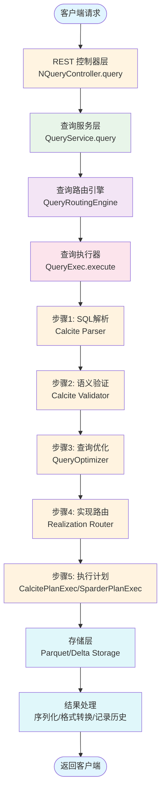

### 1.2 查询优化规则流程

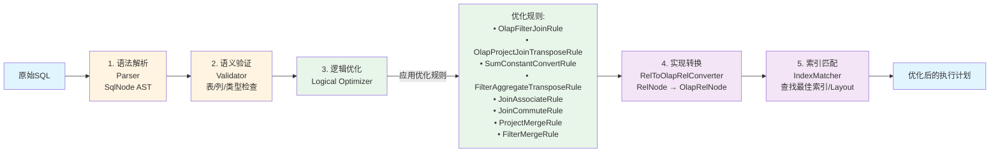

## 2. 数据构建流程

### 2.1 数据构建流程总览图

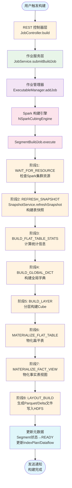

### 2.2 分段合并流程

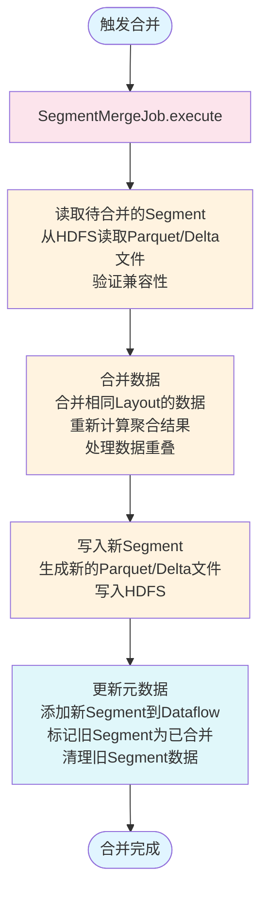

## 3. 模型管理流程

### 3.1 模型创建流程

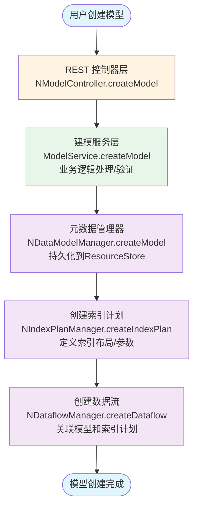

### 3.2 推荐引擎流程

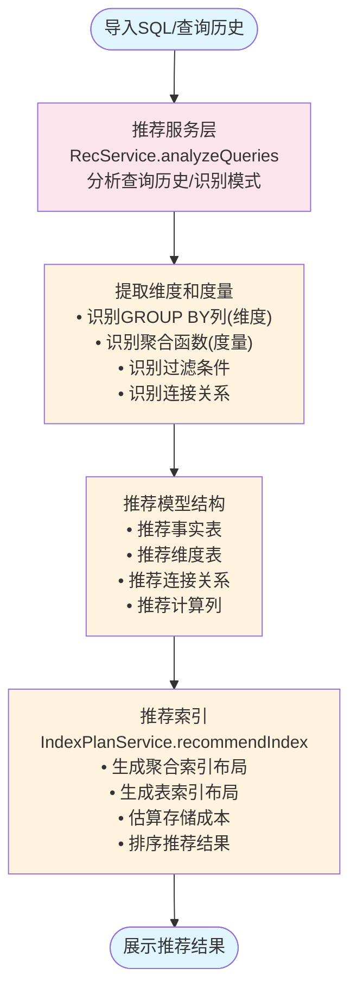

## 4. 流式数据处理流程

### 4.1 流式数据加载流程

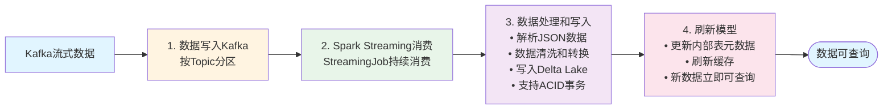

## 5. 典型用户场景

### 5.1 场景1：创建模型并构建索引

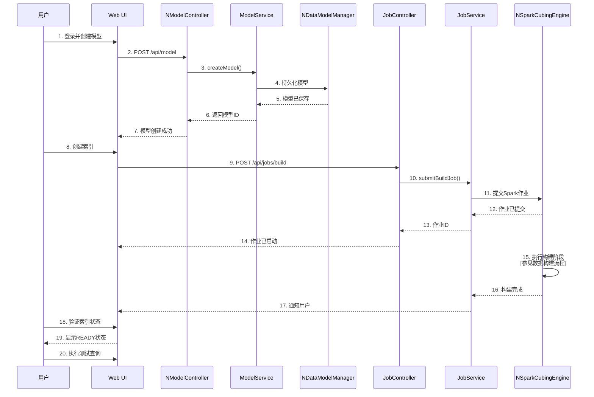

### 5.2 场景2：执行SQL查询

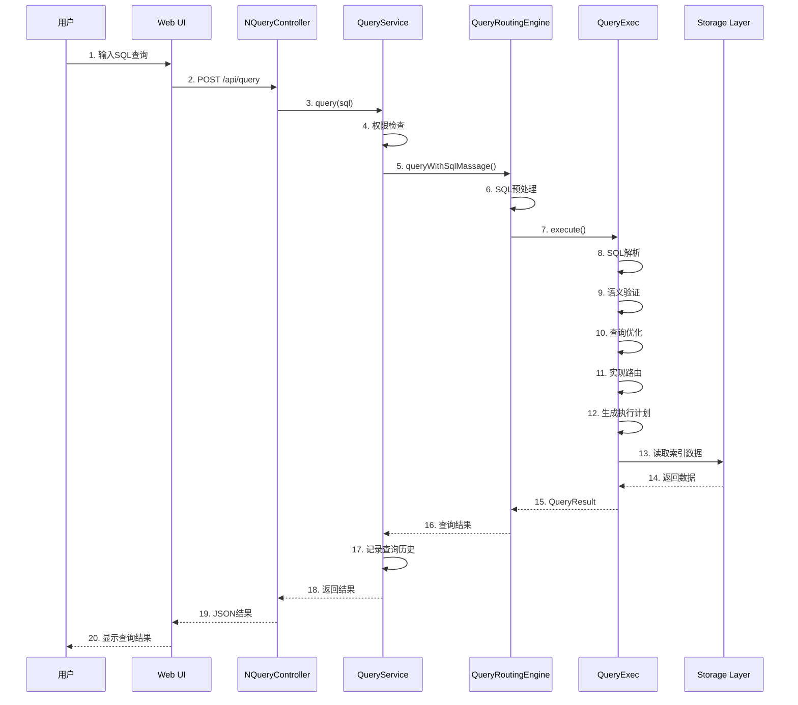

### 5.3 场景3：增量数据加载

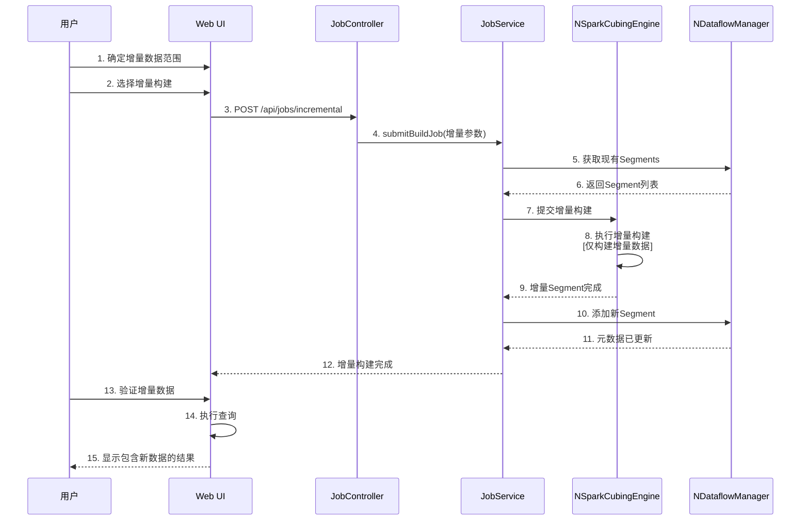

### 5.4 场景4：使用推荐引擎

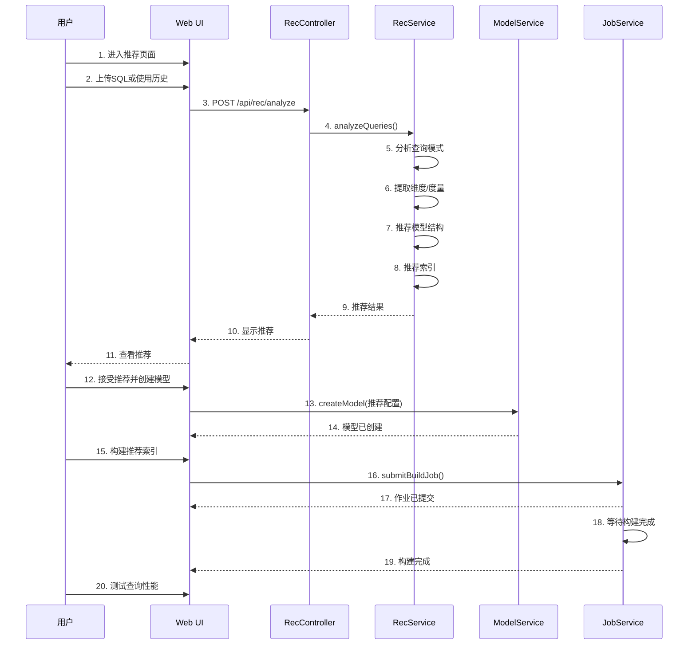

### 5.5 场景5：融合模型（批流一体）

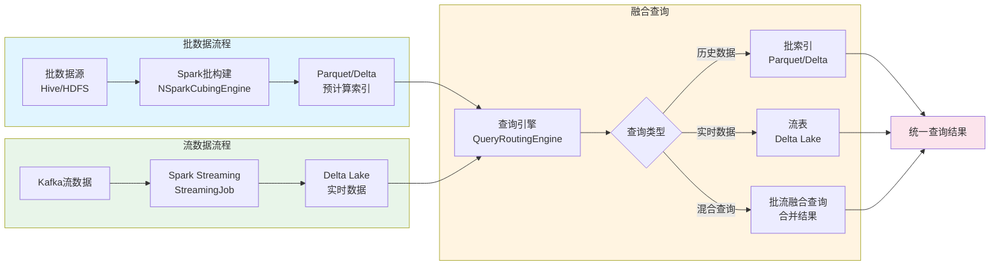

## 6. 完整的用户操作生命周期

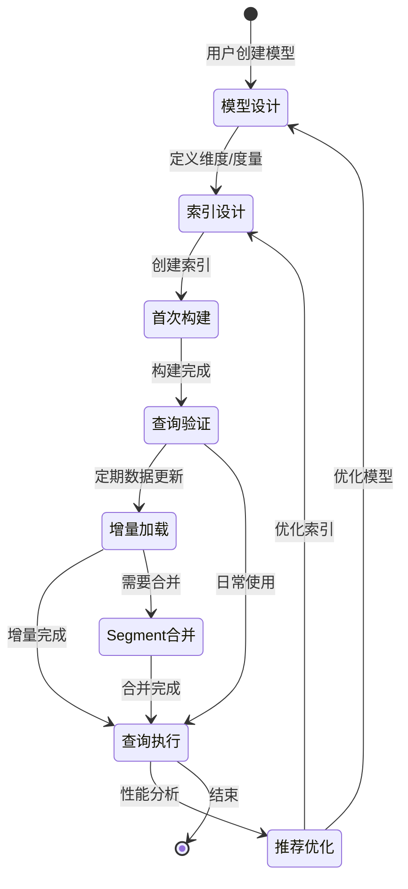

## 7. 关键文件路径索引

### 7.1 入口点
- 主启动器: `src/server/src/main/java/org/apache/kylin/rest/BootstrapServer.java`
- 查询启动器: `src/query-booter/src/main/java/org/apache/kylin/rest/QueryBootstrapServer.java`
- 数据加载启动器: `src/data-loading-booter/src/main/java/org/apache/kylin/rest/DataLoadingBootstrapServer.java`

### 7.2 核心服务
- 查询服务: `src/query-service/src/main/java/org/apache/kylin/rest/service/QueryService.java`
- 作业服务: `src/data-loading-service/src/main/java/org/apache/kylin/rest/service/JobService.java`
- 模型服务: `src/modeling-service/src/main/java/org/apache/kylin/rest/service/ModelService.java`

### 7.3 查询引擎
- 查询执行器: `src/query/src/main/java/org/apache/kylin/query/engine/QueryExec.java`
- 查询路由: `src/query/src/main/java/org/apache/kylin/query/engine/QueryRoutingEngine.java`

### 7.4 构建引擎
- Spark构建引擎: `src/spark-project/engine-spark/src/main/java/org/apache/kylin/engine/spark/NSparkCubingEngine.java`
- Segment构建作业: `src/spark-project/engine-spark/src/main/java/org/apache/kylin/engine/spark/job/SegmentBuildJob.java`

### 7.5 元数据管理
- 项目管理器: `src/core-metadata/src/main/java/org/apache/kylin/metadata/project/NProjectManager.java`
- 模型管理器: `src/core-metadata/src/main/java/org/apache/kylin/metadata/model/NDataModelManager.java`
- 索引计划管理器: `src/core-metadata/src/main/java/org/apache/kylin/metadata/cube/model/NIndexPlanManager.java`
- 数据流管理器: `src/core-metadata/src/main/java/org/apache/kylin/metadata/datflow/NDataflowManager.java`